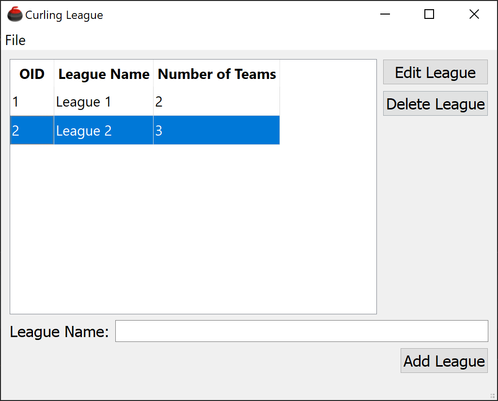
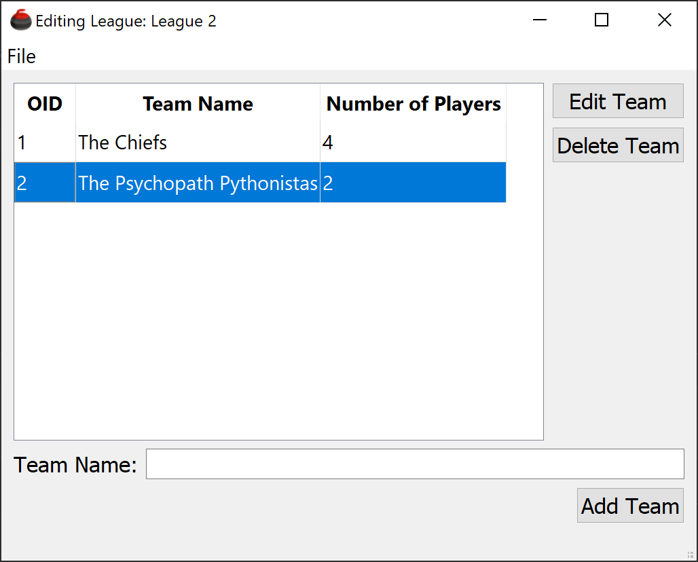
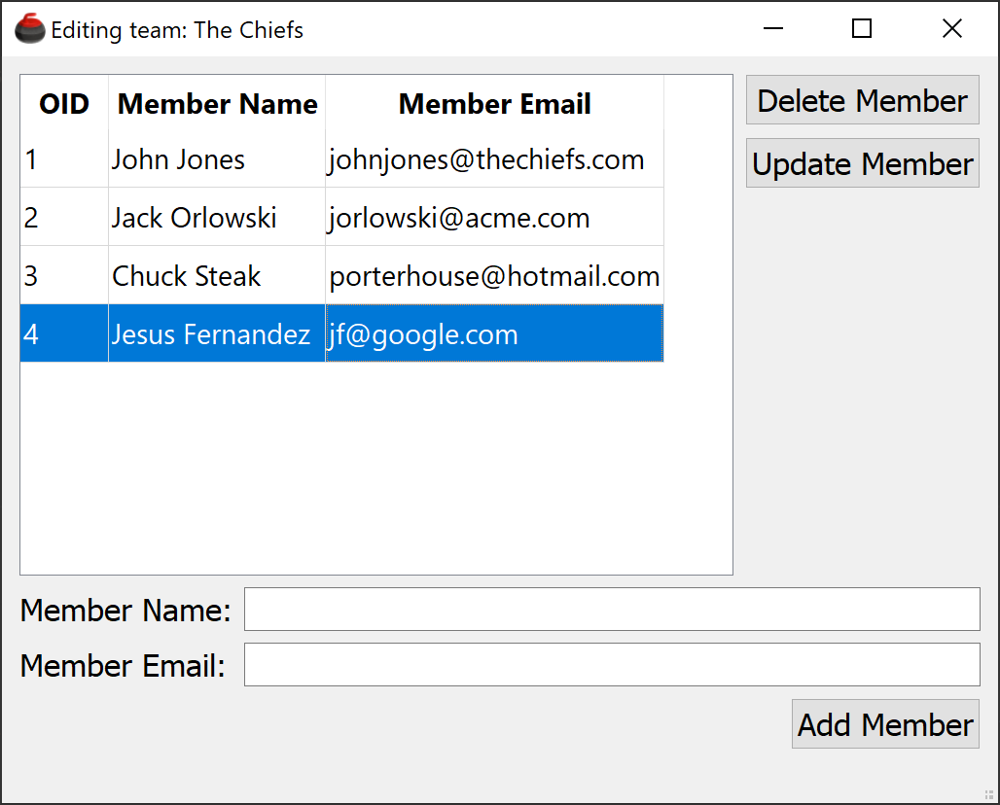

# Curling League Manager

## Overview
The Curling League Manager is a software application designed to simulate the management of curling leagues. It allows users to create leagues, add teams and players to those leagues, and perform various management tasks.

## Features
- **League Management**: Add, delete, and view existing curling leagues.
- **Team Management**: Add and delete teams in the leagues.
- **Player Management**: Add player names and emails to teams for each league.
- **User-Friendly Interface**: Intuitive interface for easy navigation and operation.

## How to Run the Application

To execute the Curling League Manager application, follow these steps:

1. **Clone the Repository**: Clone the repository containing the application source code.
2. **Navigate to the Project Directory**: Move into the directory where the application code is located.
3. **Install Dependencies**: Ensure all required dependencies are installed. They will be listed in the requirements.txt file.
4. **Run the Application**: Execute the CurlingLeague.py file.

## Screenshots

### Main Window

### League Editor

### Member Editor

## Implementation Details

I added some features to the existing code. 

1. **Dynamically assigned OIDs**: Instead of forcing the end-user to specify the object-ID, the application finds a free 
object ID to assign new objects to. The oid numbers are in sequential order. If the end-user deletes an object, the application will
not reassign object ID's. But if an end-user adds an object, such as a member to the team, the application will determine if there is
a missing oid and assign the new object the smallest missing oid.

2. **QTableWidget**: Instead of using a concatenated string to represent the Leagues, Teams, and Players, I leveraged the QTableWidget control. 
This seemed like a better approach since it eliminated the need to parse the highlighted item in a list to determine the item.

3. **Modality**: I made each window a modal QMainWindow. The window signals the parent form when it is closed, which causes the parent form to 
update its list.

4. **Content**: I was unsure what content to display for each window so for the League list, I aggregated the number of teams. For the team list, 
I aggregated the number of members, and the member list contains the member name and email.

5. **Uniqueness**: A member can have the same name as long as the email is different. Like some of the previous assignments, emails must be distinct on a team.

6. **Team Exportation**: I was unsure how I should implementing the teams to CSV. My assumption was that this was a more granular import/export because
a more comprehensive import/export feature was done with Pickle. So, teams are exported individually instead of exporting all teams associated with a league.

